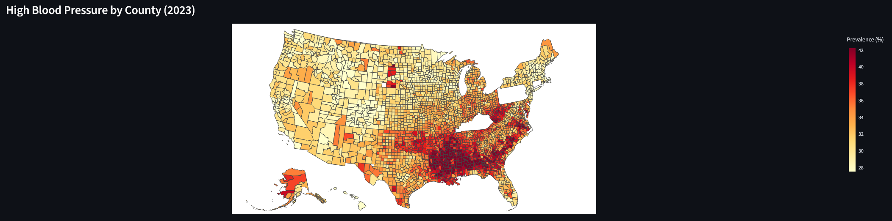
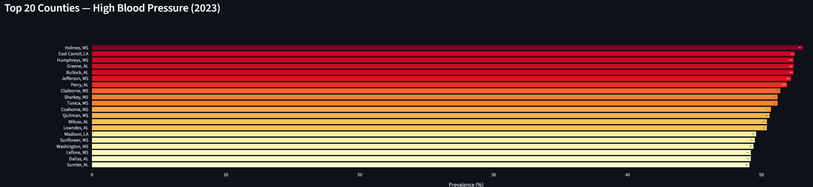
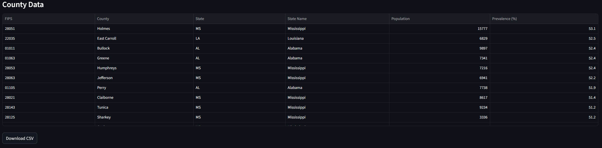

# cdc-places-pipeline

ELT pipeline ingesting CDC PLACES public health data via the Socrata API into Snowflake, transformed with dbt, and surfaced through a Streamlit dashboard.

[](https://github.com/qowboykay/cdc-places-pipeline/actions/workflows/ci.yml)


---

## Architecture

```
Socrata Open Data API  (data.cdc.gov)
        |
        v
  AWS S3  (raw JSON, partitioned by dataset + extract timestamp)
        |
        v
  Snowflake RAW schema  (COPY INTO via external stage)
        |
        v
  dbt  (STAGING layer -> INTERMEDIATE layer -> MARTS layer)
        |
        v
  Streamlit dashboard  (choropleth maps, KPI cards, filterable tables)
```

The pipeline runs automatically every Monday via GitHub Actions and can also be triggered manually from the Actions tab.

---

## Tech Stack

| Layer | Tool |
|---|---|
| Extract | Python, `sodapy`, `requests` |
| Raw storage | AWS S3 (`boto3`) |
| Warehouse | Snowflake (production), DuckDB (local dev) |
| Transform | `dbt-core`, `dbt-snowflake`, `dbt-duckdb` |
| Dashboard | Streamlit, Plotly |
| Testing | `pytest` |
| Linting / formatting | `ruff` |
| Type checking | `mypy` |
| Package manager | `uv` |

---

## Setup

**Prerequisites:** Python 3.11+, [uv](https://docs.astral.sh/uv/), AWS credentials, Snowflake account.

```bash
# Clone and install dependencies
git clone https://github.com/qowboykay/cdc-places-pipeline.git
cd cdc-places-pipeline
uv sync --all-groups

# Copy environment template and fill in values
cp .env.example .env

# Install pre-commit hooks
uv run pre-commit install
```

### Run the pipeline locally (DuckDB, no cloud required)

```bash
uv run python -m cdc_places_pipeline.cli extract --dataset places_county
uv run python -m cdc_places_pipeline.cli load --dataset places_county
uv run dbt build --project-dir dbt --profiles-dir dbt
```

### Run the pipeline against Snowflake

```bash
uv run python -m cdc_places_pipeline.cli extract --dataset places_county
uv run python -m cdc_places_pipeline.cli upload --dataset places_county
uv run python -m cdc_places_pipeline.cli snowflake-load --dataset places_county --stage-path <dataset_id>/<timestamp>
uv run dbt build --project-dir dbt --profiles-dir dbt --target snowflake
```

---

## Dashboard

The Streamlit dashboard visualizes age-adjusted prevalence estimates for 40 health measures across 3,100+ US counties.

**Run locally:**

```bash
uv run streamlit run app/dashboard.py
```

Open `http://localhost:8501` in your browser.

**Features:**

- Sidebar filters: year, measure category, and specific measure
- KPI cards: county count, coverage, average and peak prevalence
- Choropleth map with county-level shading
- Top-20 counties bar chart
- Sortable data table with CSV export





---

## Roadmap

| Phase | Description | Status |
|---|---|---|
| 0 | Repo scaffolding | Done |
| 1 | Local extract + load to DuckDB | Done |
| 2 | dbt transformations (DuckDB target) | Done |
| 3 | Streamlit dashboard (DuckDB-backed) | Done |
| 4 | Promote to AWS + Snowflake | Done |
| 5 | CI/CD for cloud pipeline | Done |
| 6 | Performance tuning and monitoring | Done |
| 7 | Polish, docs, tagged release | Done |

---

## Related Project

[cdc-places-nl-sql](https://github.com/qowboykay/cdc-places-nl-sql): Natural-language SQL assistant built on top of the Snowflake schema produced by this pipeline.
